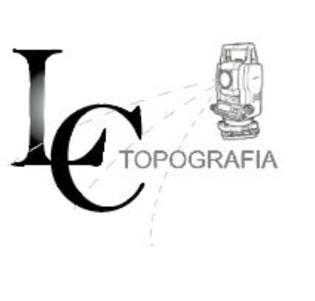
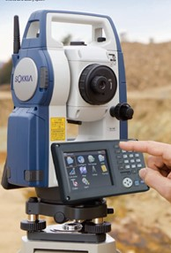
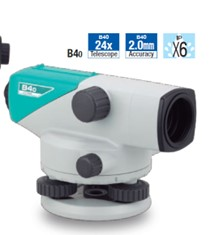
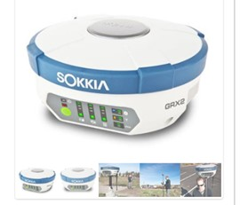

# INGENIERIA TOPOGRÁFICA

[***La topografía***](https://www.melfosur.es/que-es-la-topografia-ingenieria-topografica-estudio-del-terreno/#:~:text=La%20ingenier%C3%ADa%20topogr%C3%A1fica%20es%20una,el%20uso%20de%20recursos%20naturales.) refiere a la obtención y procesamiento de datos, el análisis de resultados y la representación gráfica de información dimensional de la superficie terrestre y su entorno, a disposición de la sociedad y comprometida con el desarrollo humano sostenible. *La topografía, catastro, geodesia y geomática* son disciplinas que comprenden el estudio de las mediciones y la representación de la tierra, con actividades humanas que se circunscriben a cumplir no solo una simple labor técnica sino que están comprometidas con la promoción y el mejoramiento de la sociedad y del medio ambiente

## LC TOPOGRAFÍA LIMITADA 

Esta Sociedad se incorpora 5 de marzo del 2014 como empresa consultora ante el Colegio Federado de Ingenieros y Arquitectos con el número ***CC-00000.*** En el año 2015 se realiza su inclusión ante el MEIC como PYMES “Pequeña Empresa del Sector Servicios ***CIIU-7110*** dedicada a servicios topográficos en general 100%, y a la fecha se encuentra registrada y activa en esta condición.

### LC toografía tiene experiencia en las siguientes áreas_

1. Estudios registrales y catastrales.
2. Elaboración de Mosaicos catastrales.
3.Verificación de linderos.
4. Comprobación geométrica de estructuras.
5.Levantameintos de curvas de nivel.
6.Nivelación Topográfica de precisión.
7.Replanteos.
8. Avalúos.

### Trayectoria de la sociedad.

Dentro del grupo que conforma la empresa, se tienen profesionales capacitados con amplia experiencia en topografía, algunos con más de 13 años de experiencia en labores afines. Contamos con personal que continuamente se está capacitando para así lograr estar a la vanguardia en el uso de nuevas tecnologías.  

### Contacto

**Dirección:** Heredia, Costa Rica. Mercedes.

**Teléfono:** 2235-6511 **Celular:** 8856-6502
**Correo electrponico:** 
lc-topografia@hotmail.com

### Proyectos

- Levantamiento de detalles en diferentes sitios de torre: CPX-1882-A, CPX-9059, CPX 1852-A, CPX 1834-A,  CPX-1842-B, CPX-9040-A, CPX-9041, CPX-8027, CPX-8016-A, CPX 8157-A, CPX-8048, CPX 7054-A, CPX 1748-A, CPX-1702-A, CPX 1773-A, COX 519-A, CPX 0010-B, CPX 1701-A, CPX 1725-A, CPX 1668-A, CPX 1716-A, CPX 1668-A, CPX 1653-A, CPX-1556, CPX-1698-A, CPX 1556.

- Construcción de Estación de Servicio Santa Clara de Florencia, sobre Ruta N°141.

-	Ampliación de parqueos para camiones, La Valencia, Inproinmobiliaria S.A.

-	Diseño y Construcción de la Obra vial para camino de lastre en las cercanías del río Celeste, Ruta Nacional N° 2-15-104., Contratación directa 2016CD-000310-01.

- Confección de planos catastrados en Residencial La Misión, Heredia.

- Diseño y Construcción de Obras de Estabilización de Talud en las Cercanías del Río Balsa, Ruta Nacional N°739, Licitación Abreviada N°.2015la-000037-0.

-	Proyecto Provisión y Construcción de la Carretera San José, Caldera Sección Ciudad Colón-Orotina.

- Mejoramiento, Ampliación y/o reconstrucción del Sistema Pluvial en la sección: Carretera de Circunvalación-Los Olivos-Zorobarú-María Aguilar.

- Ampliación de la Ruta N°3 Sección Pozuelo-Jardínes del Recuerdo.

- Diseño y Construcción del Intercambio Paso Ancho, de la Carretera de Circunvalación, Ruta Nacional N°39.

### EQUIPO TOPOGRÁFICO

- Estación Total Sokkia FX-105.

- Nivel de precisión.

.

- GPS  Doble Frecuencia.

.

[***Equipos Sokkia compañia***](https://sokkia.com.)
